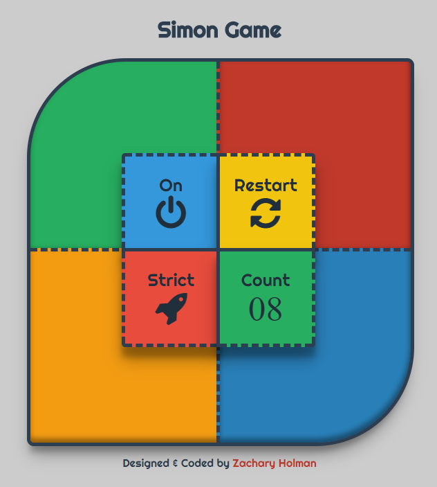

# Simon Game
A Simon Says game I have created while going through the advanced front end development project challenges at https://freeCodeCamp.com

## [Front End Development Projects](https://github.com/Squibs/freeCodeCamp/tree/master/Front%20End%20Development%20Certification#simon-game) (Go Back)
 
<a href="https://squibs.github.io/simon-game/" target="_blank"></a>

### [Simon Game](https://squibs.github.io/simon-game/) (Click to view functional site)

<em>Completed August 8, 2017</em>

This is the third advanced front end development project I completed while going thrugh freeCodeCamp. I was tasked with creating a <em>Simon Says</em> game that has a number of features. Those features being: the player is presented with a random series of button presses, each time the player inputs a series of button presses correctly they then see the same series of button presses but with an additional step, there is a sound that corresponds to each button, if the wrong button is pressed the pattern is then reshown to the player, the number of steps in the current round is visible, the game can be reset at anytime, there is a strict mode available to the player (no mistakes can be made), and finally the player can win the game after getting a series of 20 steps correct.

When I first got to the advanced front end projects, I was slightly afraid to start this one (the simon game project) as I was unsure of how to even start this project. However after completing the JavaScript Calculator project and the Pomodoro Clock project; I felt a lot more confident going into this project. Overall I learned quite a bit doing this project.

Some of the things I learned more about:

- Event listeners
	- Passing the event itself
	- Passing the event target
	- Passing ```this.value``` versus passing ```event.target.value``` (or ```event.currentTarget.value```; they can be different)

- Setting timeouts and intervals
	- While I am still slightly unsure if I am going about using these correctly, they still work for controling many aspects, especially in a game, where something needs to be slightly delayed or repeated many times.

- More about JavaScript classes
	- Working with JavaScript classes in general. Finding information on using newer ES6 classes is a bit hard when there is tons of information about using using classes from ES5 and older.

- Object Literals
	- While I did not include any in this project, I did attempt to use them at several points in this project. I was looking for a replacement to long chains of if or if-else and using switch statements.

- Using ```this```
	- I have learned about using ```this``` quite a lot more by doing this project. Many things can alter what exactly ```this``` is  referencing and I have learned several valuable lessons on when exactly ```this``` might not be what I think it is referencing.

- Using ```.bind``` for example ```.bind(this)```
	- Using ```.bind``` I have learned can also be valuable when you want specifically say what ```this``` is.

I am quite happy with how this project came out, especially the design of it. I believe I could still improve this project quite a lot, espcially as I learn more about JavaScript. I am slightly displeased with how things are on the mobile browsers; having to use a gimmicky method of getting sound to just work on iOS safari is something I'm not that happy about. In the end, this was a great project to go through in order to learn quite a lot.

        